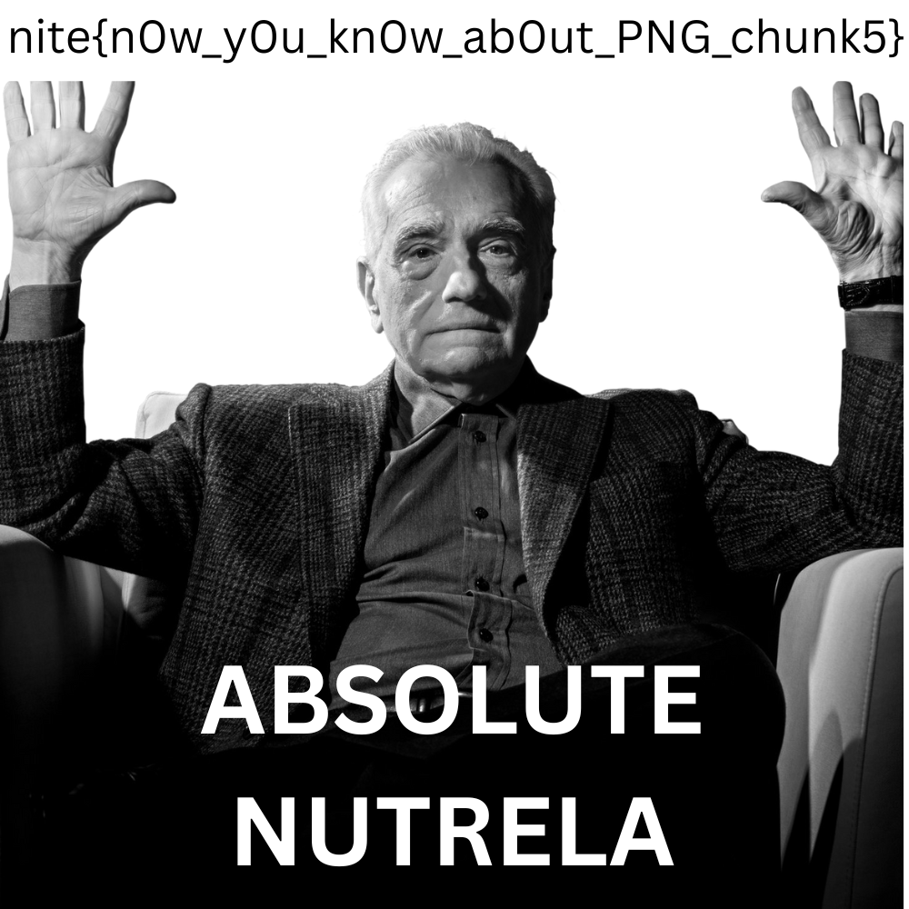
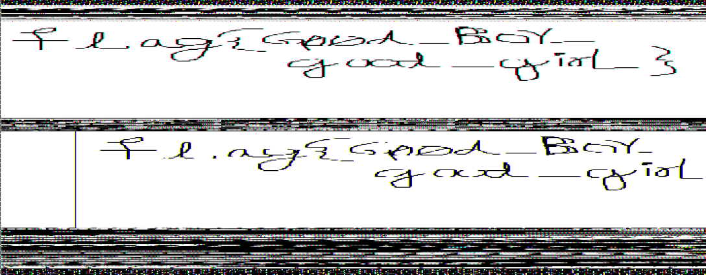

# 1. Hide and Seek

> Sakamoto’s at it again with a game of hide and seek, but this time, it’s not with Shin or his daughter. An old friend hid some secret data in this image. Can you find it before the others do?


## Solution:

- ran exiftool on the img to see hidden comments
- used stegseek with rockyou.txt wordlist to crack pass of the file and extract data
- got password as "iloveyou1" and an ascii text file which had the flag


## Flag:

```
nite{h1d3_4nd_s33k_but_w1th_st3g_sdfu9s8}
```

## Concepts learnt:

- using steghide and stegseek which is a fast password cracker for stego files

***

# 2. Nutrela Chunks
> One of my favorite foods is soya chunks. But as I was enjoying some Nutrela today, I noticed a few chunks weren’t quite right. Seems like something’s off with their structure. Could you help me fix these broken chunks so I can enjoy my meal again?


## Solution:

- since they mentioned chunks were broken, I immediately thought of using hexedit
- loaded it in hexeditor and found that the header bytes were off, fixed it
- fixed IHDR chunk, IDAT and IEND chunk as well
- 

## Flag:

```
nite{n0w_y0u_kn0w_ab0ut_PNG_chunk5}
```

## Concepts learnt:

- analysing and editing png hex chunks


## Resources:

- [read](https://medium.com/@0xwan/png-structure-for-beginner-8363ce2a9f73)
- [hexedit](https://hexed.it/)
***


# 3. RAR of the abyss
> Two philosophers peer into the networked abyss and swap a secret. Use the secret to decrypt the Abyss’ RAwR and pull your flag from the void.


## Solution:

- opened pcap file in wireshark
- noticed that TCP protocol data(with [PSH]) contains text, jus have to find a way to extract everythin together properly
- RAR file seems to be in protocol no. 17( found by following TCP streams)
- password is `b3y0ndG00dand3vil`, stuck on how to extract RAR file
- viewed the tcp packet 17 as raw bytes, saved it as .rar file and opened it(same can be saved using tshark), got flag.txt

## Flag:

```
nite{thus_sp0k3_th3_n3tw0rk_f0r3ns1cs_4n4lyst}
```

## Concepts learnt:

- using wireshark to extract tcp data


# 4. NinteTails
> Looks like I got a little too clever and hid the flag as a password in Firefox, tucked away like one of NineTails’ many tails. Recover the "logins" and the "key4" and let it guide you to the flag.

Hint:
I named my Ninetails "j4gjesg4", quite a peculiar name isn't it?


## Solution:

- extracted rar to get an .ad1 file( AccessData Forensic Toolkit Device Dump file. )
- downloaded ftk imager to view the file, went to GIC2024/AppData/Roaming/Mozilla/Firefox..j4gjesg4 profile and checked logins.json and key4.db
- on googling, realised that ill have to copy these files to my firefox profile folder to view the decrypted passwords
- 3 of the sites passwords containted parts of the flag

## Flag:

```
GCTF{m0zarella_f1ref0x_p4ssw0rd}
```

## Concepts learnt:

- analysing ad1 files using ftk imager


## Resources:

- [whats ad1 file](https://www.youtube.com/watch?v=CPup3ClC7nE)
***

# 5.Re:Draw
> Her screen went black and a strange command window flickered to life, lines of text flashed across before everything went silent. Moments later, the system crashed. By sheer luck, we recovered a memory dump. 

Note: There are three stages to this challenge and you will find three flags.

What we know: just before the crash, a black command window flickered across the screen, something in its output might still be visible if you dig through memory. She was drawing when it happened, and remnants of a painting program linger, which could reveal more if inspected in the right way. Finally, a mysterious archive hides deeper in memory, likely holding the last piece of her work.

Hint:
Learn up on volatility 2 and its various plugins and what they are used for.


## Solution:

- ran volatility2 on the file and `cmdscan` showed `St4G3$1` as the first cmd
- on running `console` command, found out that  `ZmxhZ3t0aDFzXzFzX3RoM18xc3Rfc3Q0ZzMhIX0= ` was the output for the previous `St4G3$1` cmd
- decoded this to get first flag `flag{th1s_1s_th3_1st_st4g3!!}`
- since second stage involved mspaint, i memory dumped the process `memdump` mspaint.exe and analysed it using image editor
- On messing with the image dimensions, rotating and zooming in, finally found the flag in the img `flag{G00d_BoY_good_girL}`
- 
- third stage hinted at "archives" and there was a winrar process so i mran `cmdline` to see the directory where winrar.exe was used, found `important.rar`
- googled how to download the file, saw that i have to first use filescan and grep the file name to get physical address `0x000000003fa3ebc0`
- then used `dumpfiles` cmd and passed physical address as argument
- tried opening the rar file but it required password which was hinted to be a hash, on googling found `hashdump` command
- got hash, converted to uppercase passed in password field and got flag3.png which had the flag `flag{w3ll_3rd_stage_was_easy}`


## Flag:

```
flag{th1s_1s_th3_1st_st4g3!!}
flag{G00d_BoY_good_girL}
flag{w3ll_3rd_stage_was_easy}
```


## Concepts learnt:

- using volatility to analyse memory dumps


## Resources:

- [volatility](https://infosecwriteups.com/memory-dump-analysis-by-using-volatility-framework-742d70663d41)
***
