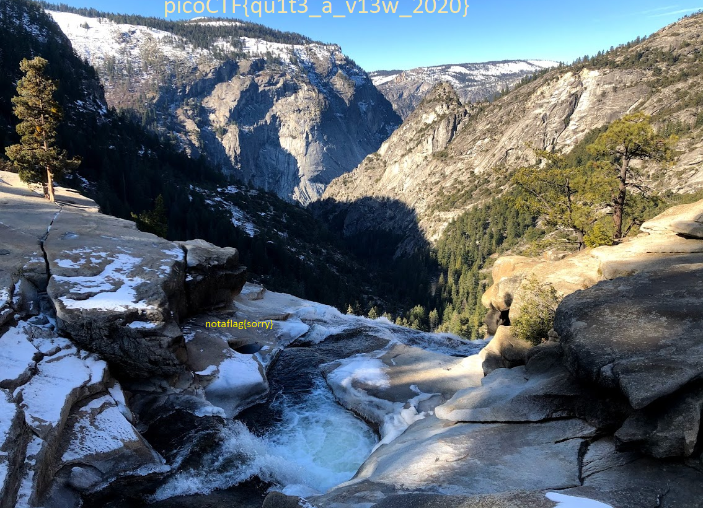

# 1. m00nwalk

> Decode this message from the moon.

## Solution:

- viewed hint 1 "how did the images get sent back to earth from moon". This gave an idea of using sstv audio decoder
- Got the flag img after decoding the audio
- 


## Flag:

```
picoCTF{beep_boop_im_in_space}
```

## Concepts learnt:

- existence of SSTV

## Resources:

- [decoder](https://sstv-decoder.mathieurenaud.fr/)


***

# 2. Trivial Flag Transfer Protocol

> Figure out how they moved the flag.

## Solution:

- used wireshark export objects to get a bunch of files from the pcap
- it had three picture?.bmp files and a program.deb file, along with plan and instructions files which had gibberish
- decoder the gibberish in instructions.txt using online decoder to get `"TFTP DOESNT ENCRYPT OUR TRAFFICS .WE MUST DISGUISE OUR FLAG TRANSFER . FIGURE OUT A WAY TO HIDE THE FLAG AND I WILL CHECK BACK FOR THE PLAN"`
- decoded the text in `plan` file to get `"I USED THE PROGRAM AND HID IT WITH - DUED I LIG EN CE. CHECKOUT THE PHOTOS"`
- used steghide to extract data from the pictures using command `steghide extract -sf picture?.bmp` for all pictures
- got stuck on the passphrase for a while and then figured out it was DUEDILIGENCE as given in the txt file
- got flag.txt from picture3.bmp


## Flag:

```
picoCTF{h1dd3n_1n_pLa1n_51GHT_18375919}
```

## Concepts learnt:

- steghide command
- convenient online decoder
- working with wireshark and pcap files

## Resources:

- [decoder](https://www.cachesleuth.com/multidecoder/)


***

# 3. tunn3l v1s10n

> We found this file. Recover the flag.

## Solution:

- on using exiftool on the file, I found out that its supposed to be a bmp img file.
```bash
hrishi@LAPTOP-AS47JO28:~/Cryptonite/hrishi_phase2/picoctf$ exiftool tunn3l_v1s10n
ExifTool Version Number         : 12.40
File Name                       : tunn3l_v1s10n
Directory                       : .
File Size                       : 2.8 MiB
File Modification Date/Time     : 2025:10:24 19:18:06+05:30
File Access Date/Time           : 2025:10:28 22:09:20+05:30
File Inode Change Date/Time     : 2025:10:28 22:07:35+05:30
File Permissions                : -rw-r--r--
File Type                       : BMP
File Type Extension             : bmp
MIME Type                       : image/bmp
BMP Version                     : Unknown (53434)
Image Width                     : 1134
Image Height                    : 306
Planes                          : 1
Bit Depth                       : 24
Compression                     : None
Image Length                    : 2893400
Pixels Per Meter X              : 5669
Pixels Per Meter Y              : 5669
Num Colors                      : Use BitDepth
Num Important Colors            : All
Red Mask                        : 0x27171a23
Green Mask                      : 0x20291b1e
Blue Mask                       : 0x1e212a1d
Alpha Mask                      : 0x311a1d26
Color Space                     : Unknown (,5%()
Rendering Intent                : Unknown (826103054)
Image Size                      : 1134x306
Megapixels                      : 0.347
```
- unable to open file as bmp, likely corrupted so i compared the hex data with a standard bmp file and fixed a few places which seemed off "BA D0" to "36 00 00 00 28 00" same as the example bmp file
- the bmp img shows not a flag sorry, so tried editin some other stuff in hex edit. The website abt bmp files gave info abt info headers where you can change size, width and height.
- searched for the image dimensions in hex data. Realised that its given in little endian format so searched for any matches to little endian format of image width and found the dimension values in hex. Edited the height from 306 to 500-800 and realised the img is getting bigger and more stuffs showing, but 900 doesnt work. So its gotta be in btwn 800-900, assuming the original img given was cropped
- setting height to 820 revealed the flag 
- 


## Flag:

```
picoCTF{qu1t3_a_v13w_2020}
```

## Concepts learnt:

- edit hex data, headers of files

## Resources:

- [hex data](https://www.file-recovery.com/bmp-signature-format.htm)


***

