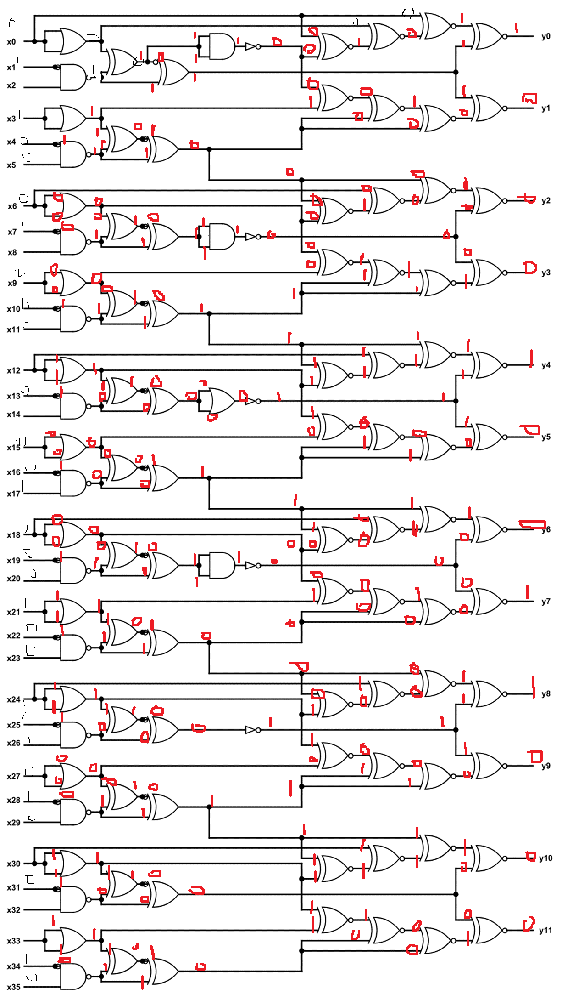

# 1. iq test

> let your input x = 30478191278.

wrap your answer with nite{ } for the flag.

As an example, entering x = 34359738368 gives (y0, ..., y11), so the flag would be nite{010000000011}.

## Solution:
- got stuck for quite some time on how to begin as with logic gates, i was normally used to givin binary input, then thought of converting given x value to binary online. got 36 digit binary `011100011000101001000100101010101110`
- had to manually workout the logic gate given with this input with positions x0-x35
- 

## Flag:

```
nite{100010011000}
```

## Concepts learnt:

- revised logic gates


***


